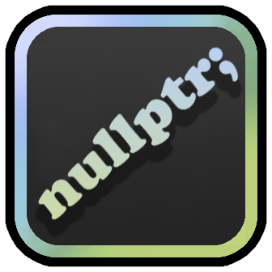

#### Mod developer was banned on Geode for dumb reasons, but he still keeps his mods up-to-date. <br>See for working latest versions at [releases page](../../releases)!
> Yes, u can't find it in geode servers, download it and install manually.

# Programming Memes

Get random endless programming memes images directly in the game using [Programming Memes Images](https://rapidapi.com/kaushalsharma880-GAglnDIvTy/api/programming-memes-images) API.

\- popup meme on game loaded

\- button in geode mods layer to popup meme

\- ability for devs to open random meme using that mod

To open random meme in your mod using that mod:
```cpp
auto openup = typeinfo_cast<CCMenuItem*>(GameManager::get()->getChildByID("popup-random-meme"));
if (openup) openup->activate();
```



*Updated logo.png to change mod's icon (yippee)*

## Getting started
We recommend heading over to [the getting started section on geode docs](https://docs.geode-sdk.org/getting-started/) for useful info on what to do next.

## Build instructions
For more info, see [our docs](https://docs.geode-sdk.org/getting-started/create-mod#build)
```sh
# Assuming you have the Geode CLI set up already
geode build
```

# Resources
* [Geode SDK Documentation](https://docs.geode-sdk.org/)
* [Geode SDK Source Code](https://github.com/geode-sdk/geode/)
* [Geode CLI](https://github.com/geode-sdk/cli)
* [Bindings](https://github.com/geode-sdk/bindings/)
* [Dev Tools](https://github.com/geode-sdk/DevTools)
